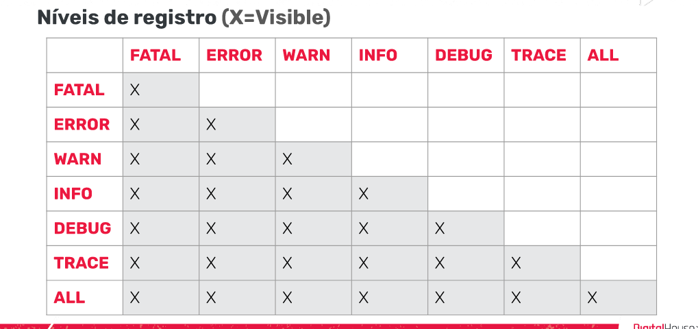

# Modulo 1: Design Paterns

LINKS:
- UML: https://www.devmedia.com.br/modelagem-de-software-com-uml/20140
- UML: https://www.devmedia.com.br/o-que-e-uml-e-diagramas-de-caso-de-uso-introducao-pratica-a-uml/23408

## Aula 01

### O que é Backend?
São como o nome diz os bastidores, ou seja, o servidor e o banco de dados que 
ajudam a fornecer informações a partir de uma interface.

O backend deve ser capaz de ter uma camada de servico para que o frontedn possa
consumi-la, e assim, ser capaz de fazer solicitações.

### Testes Unitarios

Anotações:
- @AfterEach: Executa um metodo após da execução de cada teste.

- @ParameterizedTest: Permite executar o teste, com varios argumentos. Pode pegar
parametros de diferentes fontes, como um metodo, valores, um arquivo csv.

- @AfterAll: Executa um metodo após da execução de todos teste.

- @BeforeEach: Executa um metodo antes da execução de cada teste.

- @Test: Anotação que indica para o Junit que se trata de um teste e o execute

- @BeforeAll: Executa um metodo antes da execução de todos teste.

- @Disable: Desabilita um teste para qye ele nao seja executado

Os teste unitarios tem como objetivo pegar uma pequena parte do software, isolando-a
do resto do código, para determinar se ele se comporta / funciona conforme esperado.

Cada unidade é testada separadamente antes de ser integrada aos componentes para
testar as interfaces entre as unidades.

ARRANGE(Preparar o teste) : define os requisitos que o codigo deve atender
ACT(Rodar o teste) : aqui é executado o teste que dara origem ais resultados
que iremos analisar
ASSERT(Verifica as asserções) : comprova se os resultados obtidos sao os esperados

Vantagens dos Testes unitários:
- Facilitar as mudancas de código
- Encontrar bugs
- Fornecem documentação
- Melhoram o design e a qualidade do código

Teste de integração

As unidades individuais sao integradas oara formar componentes maiores, por exemplo,
duas unidades que ja foram testadas sao combinadas em um componente integrado e a interface
entre elas é testada. Isso nos permite cobrir uma area maior do código, sobre o qual as
vezes nao temos controle.

PRINCIPIO FIRST
São as 5 caracteristicas que devem ter para serem considerados testes de qualidade

- F: Fast
- I: Isolated/independent
- R: Repeatable
- S: Self-Validating
- T: Thorough

JUNIT

Utilizamos o Junit que é a forma de testar nosso código.
È o framework open source de testing para Java mais utilizado. 
Ele nos permite escrever e executar testes automatizados. 

TESTE PARAMETRIZADO 

Em nossos testes, várias verificações são realizadas simplesmente para testar casos diferentes.
Isso nos leva a repetir o código.

Para Construir testes parametrizados, o JUnit utiliza um custom runner que é
o Parametrized.

Este nos permite definir os parametros de variaveis execuções de um unico teste.

A anotação @Parameters indica qual é o método que retornara o conjunto de parametros a serem usados
pelo runner.

O que precisamos é de um construtor que permita ser inicializado com os objetos que temos
em cada elemento da coleção. Finalmente, o teste será executado usando os dados que coletamos no 
construtor.

TESTE SUITE

JUnit Test Suite nos permite agrupar e executar os teste em grupo. As suites de testes
podem ser criadas e executadas com essas anotações

- @RunWith
- @SuiteClasses

TDD - Test Diven Development

Com TDD utilizamos testes para orientar ou direcionar a maneira como escervemos
nosso código. Normalmente, o fluxo de trabalho é descrito como Red - Green - Refactor

- RED : 
  - Durante esta fase, escrevemos os casos de teste de lógica de negócios
  - Usamos a premissa: "Um novo caso de teste no inicio sempre falhará"
    
- GREEN:
    - Durante esta fase, vamos fazer ou modificar o código simplesmente para
    fazer o teste funcionar
      
- REFACTOR:
    - Nesta fase, vamos modificar o código e nosso teste para torná-lo mais eficiente

## Aula 02

### Template Method Pattern

Abstrair todo comportamento compartilhado pelas entidades em uma classe abstrata, a partir da qual
todas essas entidades são extendidas.

PROPOSITO:
- É um design patern comportamental que define um esqueleto de um algoritimo na superclasse,
mas permite que as subclasses sobrescrevam etapas do algoritmo sem alterar sua estrutura.
  
SOLUÇÃO:
- O método esqueleto é composto pelo código que essas classes tem em comum, permitindo que
algumas partes sejam modificadas pela subclasse que o implementa, conseguindo manter o 
  código repetido em um só lugar.
  

## Aula 04

### Chain of Responsibility pattern

Padrão da corrente de responsabilidade, padrão comportamental que permite estabelecer uma
corrente entre objetos atraves da qual eh passada uma solicitação, feita por um objeto emissor
que não sabe qual é o objeto que poderá responder a ela, dessa forma os objetos
receptores passarao essa informação ate qual algum deles saiba como respondê-la.

Composto por uma classe controladora: Classe Handler, que recebe as solicitações do
cliente, inicia a corrente e define como o cliente se comunicará com ela, as subclasses
que participam da corrente processam a informação do cliente de acordo com o critério
pré-estabelecido.

PROPOSITO:
- É um design patterm comportamental que permite que as solicitações passem por uma
corrente de manipuladores. Ao receber uma solicitação, cada um deles decide se vai
  processa-la ou repassa-la ao próximo manipulador.
  
SOLUÇÃO:
- Criar uma corrente com as classes manipuladoras para processar a solicitação de um
cliente. Cada uma possui um campo para armazenar uma referencia ao próximo manipulador
  na corrente. A solicitação viaja até que todos os manipuladores tenham a chance de
  processá-la (Os manipuladores podem decidir não aprovar a solicitação e interromper
  o procedimento)

## Aula 05

### Proxy Patern

É um padrão do tipo estrutural. Cumpre a função de ser um intermediário que adiciona
a funcionalidade a uma classe sem modificá-la.

PROPOSITO:
- Seu ibjetivo é desenvolver a funcao de ser um intermediario que agrega funcionalidade
a uma classe sem tocar nela.
  
SOLUÇÃO:
- Definir uma classe proxy com a mesma interface do objeto de servico original. Posteriormente
nosso aplicativo deve ser atualizado para que os clientes se comuniquem com o proxy e não com o
  serviço de destino. Ao receber um pedido de um cliente, o proxy ira encaminha-lo para
  o servico, mais como intermediário poderemos realizar operacoes antes ou depois de direcionar
  a solicitação.
  
VANTAGENS:
- O proxy funciona mesmo se o objeto de servico não estiver pronto ou disponível
- Prinicipio de aberto/fechado: podemos introduzir novos proxies sem alterar o serviço ou clientes.
  
DESVANTAGENS:
- Ao adicionar mais de uma camanda entre o cliente e o servico real, a resposta pode ser atrasada.

## Aula 6

### Flyweight Pattern

É um padrão do tipo estrutural.

PROPOSITO:
- O padrão compartilha partes do estado do objeto entre vários objetos. Logo, ele abstrai as partes reutilizáveis e,
  ao inves de criar objetos sempre que necessário, podemos reutilizar objetos criados por outras instancias. Isso torna
  possível reduzir a capacidade de memoria exigida pela aplicativo.
  
SOLUÇÃO:
- Este padrao possui varios componentes: o cliente é o objeto que aciona a execução. A FlyweightFactory é a fabrica que
usaremos para criar os objetos flyweight ou objetos leves. O flyweight corresponde aos objetos que queremos 
  reutilizar para que sejam mais rapidos.
  
VANTAGENS:
- Reduz bastante o peso dos dados no servidor

DESVANTAGEM:
- Consome um pouco mais de tempo para realizar as buscas.

## Aula 7

### Facade Pattern

Facilita a comunicação e oculta a complexidade de interagir com diferentes módulos
Por definição, podemos dizer que o padrão facade nos ajuda  a reduzir a complexidade de interagir com um conjunto de 
subsistemas, atuando como intermediário entre o cliente e os subsistemas, permitindo-nos ter uma entrada única, 
facilitando a comunicação entre eles.

PROPOSITO:
- Facade (Fachada) é um padrao de design estrutural que fornece uma interface simplificada para uma biblioteca, 
  framework ou qualquer outro grupo complexo de classes.
  
SOLUÇÃO:
- Dispoe de uma interface que define como o cliente se comunicara com o sistema. Esta classe implementara esta interface
para receber requisicoes e se encarregara de enviar a requisicao do cliente para a classe correspondente (subsistemas).
  
VANTAGENS:
- O software se torna mais flexivel e facil de expandir
- Reduzimos o uso de objetos que lidam diretamente com o cliente, tornando o sistema mais facil de usar
- Reduzimos o acoplamento entre o cliente e os subsisteas, o que nos permite modificar os subsistemas sem afetar o 
  cliente.

DESVANTAGEM:
Alto grau de dependencia na interface da fachada(facade)

## Aula 8

### Logging

Para gerar logs, precisamos adicionar um arquivo de configuração. Vamos adiciona-lo na raiz do projeto, ou seja, na pasta
principal. 
- Na primeira linha estamos indicando o nive minimo de logging (registro) e os appenders que vamos usar. 
- A segunda linha é usada para configurar em que nivel os avisos comecarao a ser exibidos pelo console e armazenados 
no arquivo
- E, com a terceira linha, evitamos que os appenders herdem a configuração de seus appenders pais, se houver algum.

Configuracao para imprimir mensagens por console
- Na primeira linha indicamos que tipo de logger será, referindo-se a classe que ira imprimir as mensagens
- Na segunda linha, dizemos que queremos imprimi-lo diretamente do console.
- As duas ultimas linhas sao para configurar o template que cada mensagen terá.

#### LOG4J 
- é uma Biblioteca Java desenvolvida pela Apacha Software Foundation que permite os desenvolvedores escolher a saida
e o nivel de granularidade de mensagem ou logs em tempo de execucao. Ou seja, é utilizado para gerar mensagens de logging de 
forma limpa e simples, permitindo que sejam filtradas por importancia e podendo configurar sua saída por console, arquivo
dentre outros.

VANTAGENS:
- Permite ter um registro do que esta acontecendo em nossos sistemas, o que nos possibilita entender melhor os erros

DESVANTAGENS:
- Os arwuivos as vezes ficam muito grandes e ocupam muita espacos. Por isso devemos escolher bem o tipo de informacao
que queremos armazenar.
  

TIPOS DE OBJETOS

A API Log4j segue uma arquitetura em camadas, onde cada uma fornece objetos diferentes para realizar tarefas diferentes.
Essa estrutura torna o design flexível e fácil de expandir no futuro.

Objetos core: Esses são objetos obrigatórios que suportam a execução do framework.

- Logger object
- Appender object
- Layout object

Objetos de suporte: São objetos que podem fornecer recursos adicionais importantes.

- Level object
- LogManager
- Filter object
- Object render

NIVEIS DE REGISTRO

Por padrão, o Log4j possui níveis de prioridade para mensagens, entre eles:

- OFF: Este é o nível de detalhe mínimo, ele desabilita todos os logs;
- FATAL: É usado para mensagens críticas do sistema, geralmente depois de salvar a mensagem, o programa fecha;
- ERROR: Indica eventos de erro que ainda podem permitir que o aplicativo continue em execução;
-  WARN: É usado para mensagens de alerta sobre eventos;
-  INFO: Refere-se a mensagens informativas que destacam o andamento da aplicação em um nível aproximado;
- DEBUG: Designa os eventos informativos detalhados mais úteis para depurar uma aplicação;
- TRACE: É usado para exibir mensagens com um nível de detalhe mais alto do que a depuração (debug);
- ALL: É o nível máximo de detalhe. Habilita todos os logs.

## Aula X

### Transações

## Aula X

### Padrão DAO
